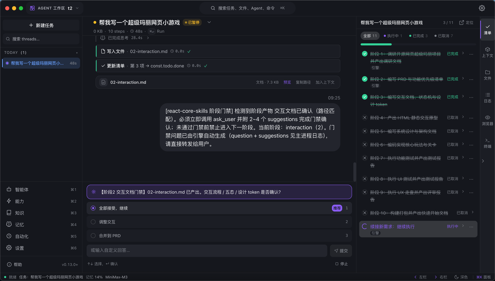
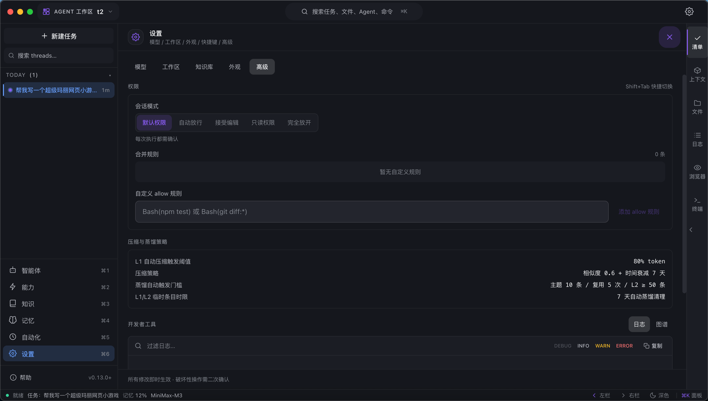
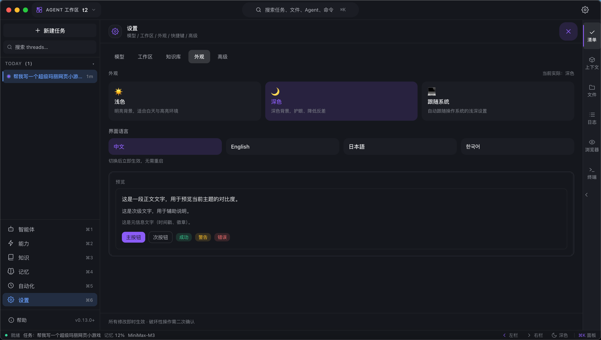
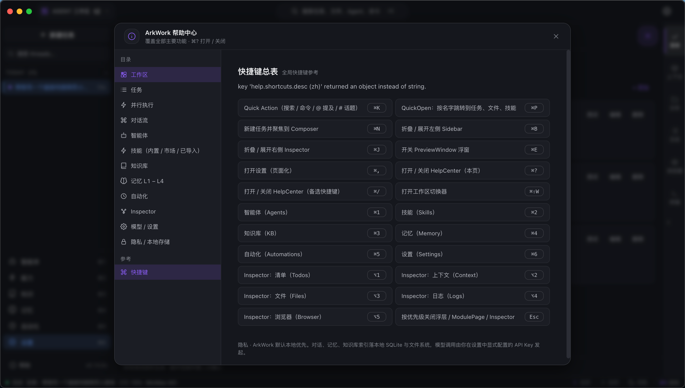

# ArkWork

**English** | [简体中文](./README.zh-CN.md) | [日本語](./README.ja.md) | [한국어](./README.ko.md)

> A local-first AI Agent workbench — making the ReAct reasoning loop **visible, controllable, and reusable**.

    



In most AI products the agent is a black box: you can't debug it, can't intervene mid-run, and can't control what enters the context. ArkWork turns the ReAct loop into a first-class object you can watch, steer, and reuse — while everything stays on your machine. No cloud, no telemetry: conversations, memory, and indexes live in plain files inside your workspace folder, and model calls are made directly with the API keys you configure.

**[Download](https://github.com/q648253885/ArkWork/releases)** pre-built installers (macOS Apple Silicon / Intel, Windows, Linux) — or build from source below.

## What's New — v0.41.0

> **Finish when you say finish — and let weak models call tools through prose** — the end-here phrase now hard-ends the task instead of being sent back to the model, and Ollama qwen3.5 models that can't emit native tool calls get a thinking-enabled text protocol the engine parses and executes for real.

### v0.41.0 · "Finish here" now really finishes

- **The end-here phrase is terminal** — clicking the suggestion or typing "Finish here" (exact match, 4 languages) stops the task immediately: full cancel semantics, a plain-language receipt, no re-planning, no extra rounds. Previously the typed phrase was sent back to the model as a new instruction and the task kept running.

### v0.41.0 · Prose tool-calling fallback (Ollama qwen3.5)

- **When the model writes tool calls as text** — some qwen3.5 endpoints never return native `tool_calls`; they print JSON like `{"tool": "file-reader", "path": "."}` in the reply. The engine now detects this class of model, **enables thinking** (Ollama returns reasoning in a separate field, keeping the reply parseable), instructs the model with a standard JSON contract, parses the answer and **executes the tools for real** — results flow back through the same Act/budget/observation pipeline as native calls.

- **Strictly gated** — activates only for Ollama-style endpoints + qwen3.5 models; every other model is byte-for-byte unchanged. Hallucinated tool names are rejected by a whitelist; malformed JSON goes through the shared repair parser; duplicate blocks are de-duplicated.

### v0.41.0 · Task list & chat stream polish (ZCode-aligned)

- **Done items archived out of sight** — the "All" filter now shows only open items; finished ones collect under a new **Ended** tab (counts always match the list). Subtasks render with indentation and composite numbering (`3.1`), in the checklist and the in-chat plan card.

- **Chat stream hierarchy** — process narration is demoted to small dim text (the last stage note keeps prominence), the process-fold line now shows **what the tools actually achieved** (failure first), and the final answer gets a distinct accent edge — the on-screen order becomes: conclusion > stage notes > process.

> Also fixed in real-machine acceptance: a migration bug that silently flattened subtask hierarchy after an app restart.
>
> Verified: `typecheck` exit 0 · **2445 cumulative tests, 0 code-fail** · version-doc gate all green · packaged `.app` real-machine UI acceptance (archiving, hierarchy, dark/light, zero failed resources).
## Official Website

**[→ www.hellowl.com](https://www.hellowl.com/)** is the official product website for ArkWork. It showcases the workbench with real in-app screenshots (ReAct task view, help center, settings & i18n), walks through the four-layer memory and the **no cloud · no telemetry · pure files** design, and hosts the download links for all three platforms (macOS / Windows / Linux). Click the link above to jump from GitHub straight to the site.

## Core Features

### 1. Visible ReAct Engine

Every task runs a Reason → Act → Observation loop that is fully streamed and persisted:

- **Live step timeline** — each Reason / Act / Observation is color-coded with iteration number, duration, and token usage; multiple tool calls in one turn execute in parallel, each with its own step entry.

- **Intervene anytime** — Pause / Resume / Cancel at any moment (`Esc`); the engine answers open questions with an `ask_user` gate and clickable suggestions, then continues exactly where it stopped.

- **Context is yours** — tick or untick any L1 working-memory item to decide whether it enters the next turn's context; a context panel breaks down injection share per source.

- **Guardrails built in** — doom-loop detection, per-signature and per-category tool-call budgets, graceful pause instead of hard failure at the iteration cap, and automatic context compaction when tokens cross a threshold.

- **Checkpoints** — a checkpoint is saved every iteration; roll back to any turn and re-run from there.

### 2. Four-Layer Memory

Memory is persisted as plain files under `<workspace>/.arkwork/` — no database, no embedding service. Retrieval uses local full-text search (MiniSearch), so the whole system works offline.

| Layer          | What it stores                                      | Behavior                                                                                            |
| -------------- | --------------------------------------------------- | --------------------------------------------------------------------------------------------------- |
| **L1 Working** | Per-task conversation, reasoning, tool observations | Toggle / edit / archive items; auto-compaction at a token threshold                                 |
| **L2 Files**   | Task artifacts and oversized tool results           | Written to the task directory, referenced by steps                                                  |
| **L3 Curated** | `memory.md` + `user.md` notes                       | "Remember this…" goes to a pending queue and merges into the next run; LLM lossy-merges on overflow |
| **L3 Archive** | Full L1 of every completed task                     | Immutable, full-text searchable across sessions                                                     |
| **L4 Profile** | Your preferences, corrections, style                | LLM-synthesized user profile, 10 versioned snapshots with rollback                                  |

A distillation pipeline turns L1 entries into reusable facts, skills, or knowledge-base items — experience compounds instead of evaporating.

### 3. Coding Agent (`@coder`)

A built-in agent tuned for real software work, powered by the same toolbelt as every agent:

- **Document-driven development** — an always-on core skill drives PRD → spec → plan → staged implementation, with **stage gates**: the agent must get your confirmation (via `ask_user`) before entering the next stage.

- **Engineering skills bundled** — `spec`, `plan`, and `bugfix` (the bugfix skill ships its own dedicated loop runner).

- **Full toolbelt** — read / write / edit files, glob & grep search, shell with 4-level command risk assessment and audit log, web search, URL fetch, browser automation, and sub-agent delegation.

- **Five permission modes** (`Shift+Tab`) — default / auto-approve / accept-edits / plan / bypass; risky tools ask for confirmation through a polished in-app layer, and approvals are remembered per session.



### 4. Knowledge Base

- Import **PDF / DOCX / TXT / Markdown**; documents are chunked on paragraph boundaries (\~500 tokens with overlap) and indexed locally.

- Enable a knowledge base **per task**; relevant chunks are also auto-recalled when a run starts.

- The agent can query it proactively via the `kb-search` skill. All indexes are local full-text — no vector DB required.

### 5. Skills & Marketplace

- One abstraction for everything an agent can use: built-in tools, MCP tools, and instruction skills (`skill.json` + `SKILL.md`).

- Instruction modes: **always-on** (injected into system prompt), **on-demand** (loaded on invoke, stays effective), or **hint-only**; skills can declare stage gates.

- Layered discovery — project > user > bundled > runtime — nearest layer shadows the others; `SKILL.md` is loaded only when invoked (progressive disclosure).

- **Marketplace**: search and one-click install community skills, with favorites and search history.

### 6. MCP Support

A zero-dependency JSON-RPC 2.0 client over **stdio**: connect multiple servers, tools are discovered via `tools/list` and injected as runtime skills (removed on disconnect), with heartbeat and automatic reconnection.

### 7. Built-in Browser

A multi-tab browser lives in the Inspector dock and is drivable by the agent:

- `snapshot` returns an interactive-element tree with stable `ref=e<N>` ids; click / type / select / press / scroll all target refs first.

- Console logs are captured; screenshots are saved and fed to multimodal models.

- **Human ↔ agent co-pilot**: clicking into the page yourself transfers control — the agent gets an explicit error instead of fighting you for the mouse.

### 8. Any LLM Provider

- Provider kinds: `openai` / `anthropic` / `ollama` / `vllm` — the OpenAI adapter covers every compatible endpoint (DeepSeek, Moonshot, Qwen, local servers…).

- Anthropic adapter implements Claude-Code-style prompt caching (≤4 cache breakpoints) and extended-thinking streaming; reasoning content and cache-hit stats are surfaced.

- Per-model capability flags, connectivity testing, and instant switching from the composer's model chip.

### 9. Automation

Cron-scheduled tasks spin up full agent runs on schedule — same-minute deduplication and a catch-up tick on launch, all persisted locally.

### 10. A Workbench, Not a Chat Box

- Three-pane layout with an IntelliJ-style Inspector dock: Todos / Context / Files / Terminal / Logs / Browser (`⌥1~6`).

- The todo list and the step timeline **scroll-sync bidirectionally** — click a checklist item to jump to the exact tool step that produced it.

- Quick Action `⌘K` (search tasks / files / agents / commands), QuickOpen `⌘P`, floating Preview `⌘E` (Markdown, code, image, SVG, table, browser).

- Dark / light themes, UI in **简体中文 · English · 日本語 · 한국어**, workspace switcher, status bar with running tasks / memory usage / active model.





## Tech Stack

| Layer       | Choice                                                     |
| ----------- | ---------------------------------------------------------- |
| Runtime     | Electron 33 + Node.js (ESM)                                |
| Build       | electron-vite 2.3 + Vite 5 + electron-builder 26           |
| Frontend    | React 18.3 + TypeScript 5.6 + Tailwind CSS 3.4 + Zustand 5 |
| LLM SDK     | `@anthropic-ai/sdk` + `openai`                             |
| Search      | MiniSearch (local full-text, no vector DB)                 |
| Persistence | File system (JSON / JSONL) — no database                   |

## Quick Start

Requirements: Node.js ≥ 18, npm.

```bash
git clone https://github.com/q648253885/ArkWork.git
cd ArkWork/app
npm install
npm run dev
```

In dev mode the main process uses `.dev-data/` as userData, the Vite dev server listens on `http://localhost:5174/`, and the Electron window opens automatically.

Build installers:

```bash
npm run build:mac    # macOS dmg + zip (Apple Silicon arm64 + Intel x64) → app/release/
npm run build:win    # Windows NSIS installer (x64)
```

### Configure a Model

On first launch open **Settings → Models** (`⌘,`):

1. Click **Add Model**
2. Fill in id / name / kind (`openai` / `anthropic` / `ollama` / `vllm`) / baseURL / apiKey
3. Click **Test** to verify connectivity
4. Save, then switch models any time via the model chip at the bottom of the composer

## Documentation

| Language | User Guide                                             |
| -------- | ------------------------------------------------------ |
| 简体中文     | [docs/user-guide.zh-CN.md](./docs/user-guide.zh-CN.md) |
| English  | [docs/user-guide.en.md](./docs/user-guide.en.md)       |
| 日本語      | [docs/user-guide.ja.md](./docs/user-guide.ja.md)       |
| 한국어      | [docs/user-guide.ko.md](./docs/user-guide.ko.md)       |

The guides cover installation, model configuration, core concepts (workspace / task / agent / skill / memory / knowledge base), daily workflows, keyboard shortcuts, FAQ, and troubleshooting.

## Project Structure

```
ArkWork/
├── app/                        # Electron application
│   ├── src/
│   │   ├── main/               # Main process (agent engine / memory / kb /
│   │   │                       #   automation / mcp / checkpoint / ipc / llm /
│   │   │                       #   store / fs / browser …)
│   │   ├── preload/            # Preload bridge (contextBridge)
│   │   ├── renderer/           # Renderer process (React UI, i18n ×4 locales)
│   │   ├── shared/             # Shared types & utilities
│   │   └── test/               # Test infrastructure (electron stub loader)
│   ├── scripts/                # Unified test runner + i18n tooling
│   └── build-resources/        # App icons & packaging resources
├── docs/                       # User documentation + screenshots
└── README.md
```

## Keyboard Shortcuts

| Keys        | Action                                                         |
| ----------- | -------------------------------------------------------------- |
| `⌘K`        | Quick Action (search / commands / `>` `@` `#`)                 |
| `⌘P`        | Quick file open                                                |
| `⌘B`        | Toggle sidebar                                                 |
| `⌘,`        | Settings                                                       |
| `⌘1~6`      | Agents / Skills / Knowledge / Memory / Automations / Settings  |
| `⌥1~6`      | Inspector: Todos / Context / Files / Terminal / Logs / Browser |
| `⌘E`        | Preview window                                                 |
| `Shift+Tab` | Cycle permission mode                                          |
| `Esc`       | Close overlay / pause or stop the running task                 |

The full map lives in the in-app Help Center (`⌘/`).

## Testing

```bash
cd app
npm test            # unified runner: auto-discovers src/**/__tests__/*.test.ts(x)
npm run typecheck   # tsc for node & web configs
```

## License

[Apache License 2.0](./LICENSE)
