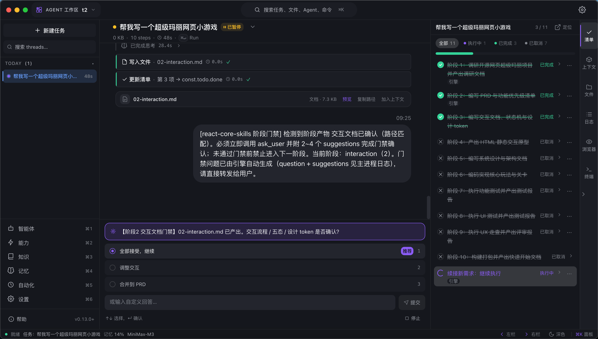
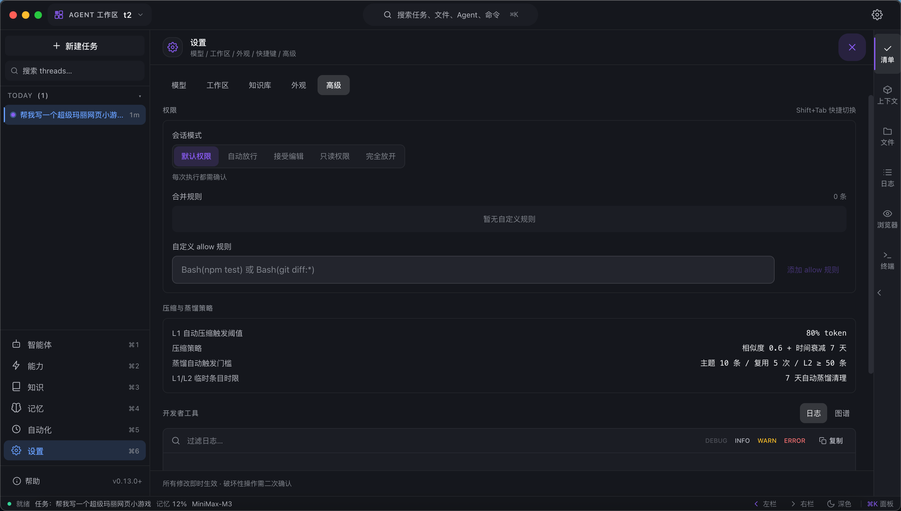
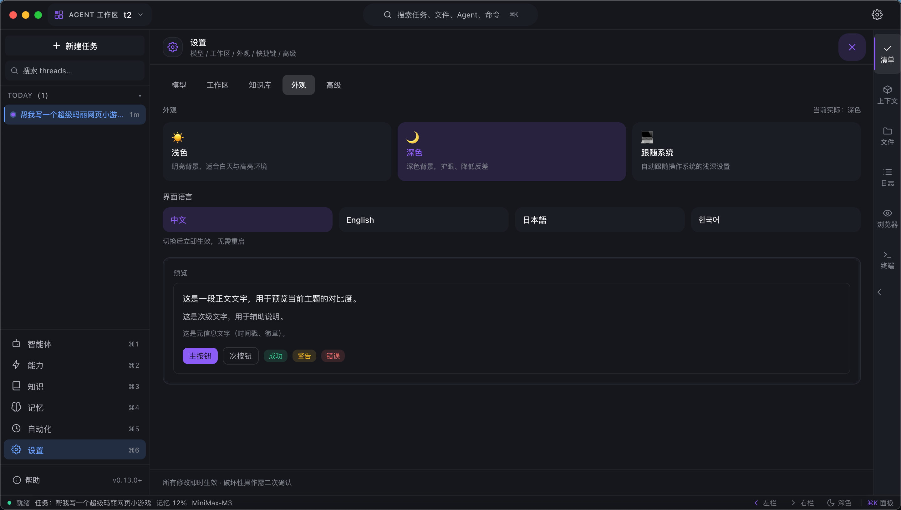
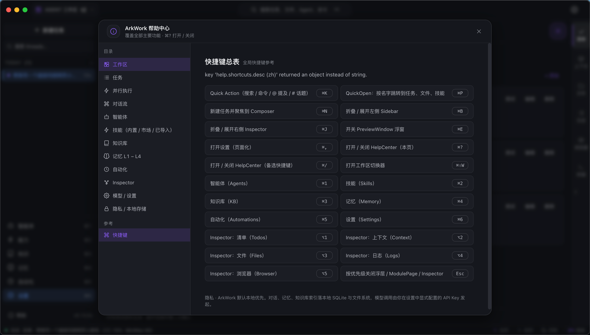

# ArkWork

[English](./README.md) | **简体中文** | [日本語](./README.ja.md) | [한국어](./README.ko.md)

> 本地优先的 AI Agent 工作台 — 让 ReAct 推理循环**可见、可控、可复用**。

   



主流 AI 产品的 Agent 推理是黑盒：用户无法调试、无法在中间状态介入、上下文不可控。ArkWork 把 ReAct 循环变成头等对象，你可以观察、引导、并复用它 — 所有数据都留在本机。无云端、无埋点：对话、记忆、索引以纯文件形式保存在你的工作区文件夹里，模型调用通过你配置的 API Key 直接发起。

**[下载](https://github.com/q648253885/ArkWork/releases)** 预编译安装包（macOS Apple Silicon / Intel、Windows、Linux），或按下方指南从源码构建。

> **官方官网**：[www.hellowl.com](https://www.hellowl.com/) — 产品主页、功能介绍、真机截图与下载入口。

## 核心功能

### 1. 可见的 ReAct 引擎

每个任务都运行一个 Reason → Act → Observation 循环，完整流式推送并持久化：

- **实时步骤时间线** — 每一步 Reason / Act / Observation 用颜色标注，显示迭代号、耗时、token 消耗；同一轮多个工具调用并行执行，每条独立成步。
- **随时介入** — 任意时刻可 Pause / Resume / Cancel（`Esc`）；引擎在需要确认时通过 `ask_user` 闸门停下，给你可点击的建议，确认后从断点继续。
- **上下文由你掌控** — L1 工作记忆每条可勾选，决定是否进入下一轮；Context 面板按来源拆解注入占比。
- **内置安全防护** — doom-loop 检测、签名级 + 类别级工具调用预算、迭代上限触顶优雅暂停而非硬失败、token 超阈值自动压缩。
- **Checkpoint 检查点** — 每轮自动存档，可回滚到任意一轮并从该点重跑。

### 2. 四层记忆体系

记忆以纯文件形式持久化在工作区目录 `<workspace>/.arkwork/` 下，**无数据库、无 embedding 服务**。检索使用本地全文检索（MiniSearch），整套系统可完全离线运行。

| 层级 | 存储内容 | 行为特性 |
|------|----------|----------|
| **L1 工作记忆** | 单任务的对话、推理、工具 observation | 可勾选 / 编辑 / 归档；token 超阈值自动压缩 |
| **L2 文件记忆** | 任务产物与超大工具结果 | 写入任务目录，由步骤引用 |
| **L3 策展** | `memory.md` + `user.md` 笔记 | 「记住…」先进 pending 区，下一轮合并；超限时 LLM 有损归并 |
| **L3 档案** | 每个已完成任务的完整 L1 | 不可变、跨会话可全文检索 |
| **L4 用户画像** | 偏好、纠正、风格观察 | LLM 合成 ≤500 tokens 版本化档案，保留 10 版可回滚 |

蒸馏管线把 L1 条目转化为可复用的事实、技能或知识库条目 — 经验持续沉淀，不再蒸发。

### 3. Coding 智能体（`@coder`）

内置、面向真实软件工程的智能体，使用与其他 Agent 相同的工具集：

- **文档驱动开发** — 一个 always-on 的核心技能驱动 PRD → spec → plan → 分阶段实现，配套**阶段门禁**：进入下一阶段前必须通过 `ask_user` 拿到你的确认。
- **工程技能捆绑** — `spec`、`plan`、`bugfix`（bugfix 技能自带独立 loop runner）。
- **完整工具集** — 读 / 写 / 编辑文件、glob & grep 搜索、shell（4 级命令风险评估 + 审计日志）、web 搜索、URL 抓取、浏览器自动化、子智能体委派。
- **五级权限模式**（`Shift+Tab`） — default / auto-approve / accept-edits / plan / bypass；高危工具通过美观浮层请求确认，授权按会话记忆。



### 4. 知识库

- 支持导入 **PDF / DOCX / TXT / Markdown**；文档按段落边界切块（约 500 tokens + 重叠），本地建立索引。
- **按任务启用** 知识库；任务启动时还会做自动召回注入。
- Agent 可通过 `kb-search` 技能主动检索。**无需向量数据库**。

### 5. 技能与市场

- 一个统一抽象覆盖 Agent 能使用的所有东西：内置工具、MCP 工具、指令型技能（`skill.json` + `SKILL.md`）。
- 指令模式：**always-on**（注入系统提示）、**on-demand**（按需加载并持续生效）、**hint-only**；技能可声明门禁。
- 分层加载 — project > user > bundled > runtime — 最近层遮蔽下层；`SKILL.md` 仅在调用时按需加载（渐进式披露）。
- **技能市场**：搜索并一键安装社区技能，配套收藏与搜索历史。

### 6. MCP 支持

自实现的零依赖 JSON-RPC 2.0 客户端，**stdio 传输**：多 server 并发管理，通过 `tools/list` 发现工具并注入为运行时技能（断连自动移除），带心跳与自动重连。

### 7. 内置浏览器

多 Tab 浏览器嵌入 Inspector Dock，可被 Agent 自主驱动：

- `snapshot` 输出带稳定 `ref=e<N>` 编号的可交互元素树；click / type / select / press / scroll 优先按 ref 定位。
- 捕获 console 日志；截图落盘并喂给多模态模型。
- **人机协同**：你点击进入页面即取得控制权，Agent 会得到明确错误而非抢回鼠标。

### 8. 任意 LLM Provider

- Provider 类型：`openai` / `anthropic` / `ollama` / `vllm` — OpenAI 适配器覆盖所有 OpenAI 兼容端点（DeepSeek、Moonshot、Qwen、本地服务…）。
- Anthropic 适配器实现 Claude Code 风格的 prompt caching（≤4 断点）和 extended thinking 流式；reasoning content 与缓存命中统计已可视化。
- 按模型声明能力位、内置连通性测试，Composer 底部 chip 随时切换。

### 9. 自动化

Cron 调度的任务到点自动启动完整 Agent 流程；同分钟去重、启动补 tick，全本地持久化。

### 10. 这是工作台，不是聊天框

- 三栏布局 + IntelliJ 风格的 Inspector Dock：Todos / Context / Files / Terminal / Logs / Browser（`⌥1~6` 切换）。
- 清单列表与步骤时间线**双向滚动同步** — 点击清单条目，跳转到生成它的具体工具步骤。
- Quick Action `⌘K`（搜任务 / 文件 / Agent / 命令）、QuickOpen `⌘P`、浮窗 Preview `⌘E`（Markdown、代码、图片、SVG、表格、浏览器）。
- 暗色 / 浅色主题，界面支持 **简体中文 · English · 日本語 · 한국어**，工作区切换器，状态栏显示运行任务数 / 记忆占用 / 当前模型。





## 技术栈

| 层面 | 选型 |
|------|------|
| 运行时 | Electron 33 + Node.js（ESM） |
| 构建 | electron-vite 2.3 + Vite 5 + electron-builder 26 |
| 前端 | React 18.3 + TypeScript 5.6 + Tailwind CSS 3.4 + Zustand 5 |
| LLM SDK | `@anthropic-ai/sdk` + `openai` |
| 检索 | MiniSearch（本地全文，无需向量数据库） |
| 持久化 | 文件系统（JSON / JSONL），无数据库 |

## 快速开始

前置要求：Node.js ≥ 18，npm。

```bash
git clone https://github.com/q648253885/ArkWork.git
cd ArkWork/app
npm install
npm run dev
```

开发模式下：主进程以 `.dev-data/` 作为 userData，Vite dev server 监听 `http://localhost:5174/`，Electron 窗口自动打开。

打包安装包：

```bash
npm run build:mac    # macOS dmg + zip（Apple Silicon arm64 + Intel x64），产物在 app/release/
npm run build:win    # Windows nsis 安装器 (x64)
```

### 配置模型

首次启动打开 **设置 → 模型**（`⌘,`）：

1. 点击「添加模型」
2. 填写 id / name / kind（`openai` / `anthropic` / `ollama` / `vllm`）/ baseURL / apiKey
3. 点击「测试」确认连通
4. 保存后即可在 Composer 底部模型 chip 随时切换

## 使用文档

| 语言 | 使用指南 |
|------|----------|
| 简体中文 | [docs/user-guide.zh-CN.md](./docs/user-guide.zh-CN.md) |
| English | [docs/user-guide.en.md](./docs/user-guide.en.md) |
| 日本語 | [docs/user-guide.ja.md](./docs/user-guide.ja.md) |
| 한국어 | [docs/user-guide.ko.md](./docs/user-guide.ko.md) |

使用指南覆盖：安装、模型配置、核心概念（工作区 / 任务 / 智能体 / 技能 / 记忆 / 知识库）、日常操作流程、快捷键、常见问题与故障排除。

## 目录结构

```
ArkWork/
├── app/                        # Electron 应用
│   ├── src/
│   │   ├── main/               # 主进程（agent 引擎 / memory / kb / automation /
│   │   │                       #   mcp / checkpoint / ipc / llm / store /
│   │   │                       #   fs / browser …）
│   │   ├── preload/            # Preload 桥（contextBridge）
│   │   ├── renderer/           # 渲染进程（React UI，i18n 四语言）
│   │   ├── shared/             # 共享类型与工具
│   │   └── test/               # 测试基建（electron 桩 loader）
│   ├── scripts/                # 统一测试 runner + i18n 工具
│   └── build-resources/        # 应用图标与打包资源
├── docs/                       # 用户文档 + 截图
└── README.md
```

## 键盘快捷键

| 快捷键 | 功能 |
|--------|------|
| `⌘K` | Quick Action（搜索 / 命令 / `>` `@` `#`） |
| `⌘P` | 文件快速打开 |
| `⌘B` | 切换侧栏 |
| `⌘,` | 设置 |
| `⌘1~6` | 智能体 / 技能 / 知识库 / 记忆 / 自动化 / 设置 |
| `⌥1~6` | Inspector：Todos / Context / Files / Terminal / Logs / Browser |
| `⌘E` | Preview 浮窗 |
| `Shift+Tab` | 循环权限模式 |
| `Esc` | 关闭浮层 / 暂停或停止运行中的任务 |

完整快捷键表见应用内帮助中心（`⌘/`）。

## 测试

```bash
cd app
npm test            # 统一 runner：自动发现 src/**/__tests__/*.test.ts(x)
npm run typecheck   # tsc 校验 node & web 两套 tsconfig
```

## License

[Apache License 2.0](./LICENSE)